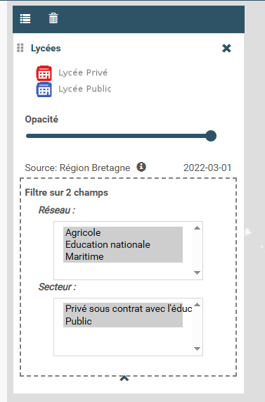

.. Authors :
.. mviewer team

.. _configcustomcontrol:

Configurer - Custom control
===========================

Un custom control est une interface permettant à l'utilisateur d'interagir avec une couche. Le customcontrol est affiché dans le bloc de légende associée à la couche concernée.
Un custom control est associé à une seule couche et est constitué de deux fichiers **html** + **javascript**. Ces deux fichiers doivent obligatoirement être nommé comme l' ``id`` de la couche associée.

**Syntaxe**

.. code-block:: XML
	:emphasize-lines: 2,3

	<layer id="moncustom"
		customcontrol="true"
		customcontrolpath="chemin_vers_fichiers">
	</layer>

**Paramètres custom control**

* ``customcontrol``: paramètre qui indique si mviewer doit charger un customcontrol. valeurs : true || false. Défaut = false.
* ``customcontrolpath``: paramètre qui indique où mviewer doit charger le customcontrol. Si ce paramètre n'est pas renseigné, le customcontrol est recherché dans le répertoire racine **customcontrols**.

**Exemple**

.. code-block:: XML
    :caption: config.xml
    :emphasize-lines: 7-8

	<layer id="heatmap"
        name="Earthquakes Heatmap"
        visible="true"
        url="demo/heatmap/customlayer.js"
        queryable="true"
        type="customlayer"
        customcontrol="true"
        customcontrolpath="demo/heatmap/control"
        legendurl="demo/heatmap/legend.png"
        opacity="1"
        expanded="true"
        attribution=""
        metadata=""
        metadata-csw="">
    </layer>

.. _multiplefilter:

Cas pratique : customcontrol pour avoir plusieurs filtres sur une couche
------------------------

Ce customcontrol permet d'avoir la possibilité de filtrer une couche type WMS sur plusieurs attributs comme ceci : 

**Création du customcontrol**

Comme détaillé dans la page :ref:`customcontrol`, un customcontrol est composé de 2 fichiers. Dans le cas du filtre sur plusieurs atttributs d'une couche WMS, vous trouverez les fichiers dans le dossier /demo/filtres_multiples/customcontrol.
Les 2 fichiers doivent avoir le même nom que l'id de la couche appelée dans mviewer.

Ici le fichier HTML qui s'affichera en dessous de la légende :

.. code-block:: HTML
    :caption: lycee.html
    :emphasize-lines: 2

    

        <label>Filtre sur 2 champs</label>
        
    

Et ici le fichier javascript. Pour l'utiliser sur une de ces couches, il faudra modifier l'id de la couche (ici lycee) par l'id de votre donnée.

.. code-block:: javascript
    :caption: lycee.js
    :linenos:
    :emphasize-lines: 1-3

    //Modifier lycee par l'id de votre couche
    mviewer.customControls.lycee = (function () {
    const _idlayer = "lycee";
    const _layer = mviewer.getLayer(_idlayer);
    let noFilterLabel = "All";
    let logicalOperator = "AND";

    return {
        init: function () {
        // mandatory - code executed when panel is opened
        const _html = [];
        //Check for xml config ccfilters
        let filters = [];
        if (_layer.ccfilters && _layer.ccfilters.filter) {
            //Convert filter to Array if is not Array (Fix one filter bug)
            if (!Array.isArray(_layer.ccfilters.filter)) {_layer.ccfilters.filter = [_layer.ccfilters.filter]}
            //Configuration
            if (_layer.ccfilters.logicaloperator) { logicalOperator = _layer.ccfilters.logicaloperator; }
            if (_layer.ccfilters.nofilterlabel) { noFilterLabel = _layer.ccfilters.nofilterlabel; }
            filters = _layer.ccfilters.filter.map(function(f) { return {
                'label' : f.label,
                'field' : f.field,
                'values' : f.values.split(","),
                'multiple': (f.multiselection && f.multiselection == "true")
            }
            });
        } else {
            console.log(`Le customcontrol ${_idlayer} n'a pu être initialisé car la conf xml est incomplète (propriété ccfilters)`)
        }
        filters.forEach(function(f) {
            const options = f.values.map(function(v) {return `<option ${f.multiple?'selected':''}>${v}</option>`});
            if (!f.multiple) {
            options.unshift(`<option>${noFilterLabel}</option>`);
            }
            const select = `

            <label for="${_idlayer}-${f.field}">${f.label} :</label>
            

            <select ${f.multiple?'multiple':''} placeholder="${f.label}" id="${_idlayer}-${f.field}" data-source="${f.field}" class="form-control cql-filter" onchange="mviewer.customControls.${_idlayer}.filter(this);">
                ${options.join("")}
            </select>
            

        
`;
        _html.push(select);
        });
        document.querySelector(".cql-filter-list>style").insertAdjacentHTML("afterend", _html.join("\n"));

        },

        filter: function(element) {
        const _filter = [];
        element.closest(".cql-filter-list").querySelectorAll(".cql-filter").forEach(function(q) {
            const values = Array.from(q.selectedOptions).map(({ value }) => value);
            if (values.length == 1) {
            // Filtres avec choix unique
            const value = values[0];
            if (value != noFilterLabel) {
                _filter.push(`${q.dataset.source} = '${value.replace("'", "''")}'`);
            }
            } else {
            // Filtres avec choix multiple
            const list = []
            values.forEach(function(value) {
                list.push(`'${value.replace("'", "''")}'`)
            })
            _filter.push(`${q.dataset.source} in (${list.join(',')})`);
            }

        });
        console.log(_filter);
        const layer = _layer.layer;
        const _source = layer.getSource();
        const params = _source.getParams();
        params.t = new Date().getMilliseconds();
        if (_filter.length > 0) {
            const cql_filter = _filter.join(` ${logicalOperator} `);
            params.CQL_FILTER = cql_filter;
        } else {
            params.CQL_FILTER = "1=1";
        }
        _source.updateParams(params);

        },

        destroy: function () {
        // mandatory - code executed when panel is closed
        },
    };
    })();

**Paramétrage dans le XML**

Une fois le customcontrol créé, il va falloir l'appeler dans votre application. Tout d'abord en ajoutant les options customcontrol et customcontrolpath puis les paramètres du customcontrol, ici contenus dans ccfilters.

.. code-block:: XML
    :caption: lycee.xml
    :emphasize-lines: 4,9-12

    <layer id="lycee" name="Lycées"  visible="true" tiled="false"
        searchable="false" queryable="true" expanded="true"
        infoformat="application/vnd.ogc.gml" featurecount="20"
        customcontrol="true" customcontrolpath="demo/filtres_multiples/customcontrols"
        url="https://ows.region-bretagne.fr/geoserver/rb/wms" 
        attribution="Source: Région Bretagne" 
        metadata="https://kartenn.region-bretagne.fr/geonetwork/srv/fre/catalog.search#/metadata/99e78163-ce9a-4eee-9ea0-36afc2a53d25"
        metadata-csw="https://kartenn.region-bretagne.fr/geonetwork/srv/eng/csw?SERVICE=CSW&amp;VERSION=2.0.2&amp;REQUEST=GetRecordById&amp;elementSetName=full&amp;ID=99e78163-ce9a-4eee-9ea0-36afc2a53d25" >	   
        <ccfilters logicaloperator="and" nofilterlabel="Toutes">
            <filter label="Réseau"  field="reseau_lib" values="Agricole,Education nationale,Maritime" multiselection="true"/>
            <filter label="Secteur"  field="secteur_li" values="Privé sous contrat avec l'éducation nationale,Public" multiselection="true"/>
        </ccfilters>
        <template url="https://kartenn.region-bretagne.fr/kartoviz/apps/region/global/templates/global.lycee.mst"></template> 
    </layer> 

.. Note::
    Apprendre par l'exemple :

    - :ref:`customcontrol`